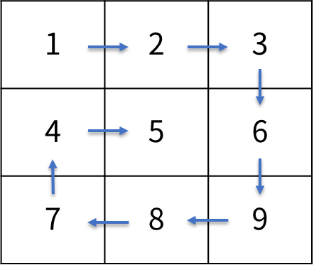

Practice4
===

문제 설명
---
<<<<<<< HEAD
특수 작전을 위해 상대방의 PC에 키보드 입력 내용을 얻을 수 있는 키로깅 프로그램을 설치했다.

해당 키로깅 프로그램으로부터는 아래와 같이 특정 값으로 내용이 수신된다.
* 8 : Backspace
* 16 : Shift
* 20 : Caps Lock
* 32 : Space bar
* 37 : 키보드 왼쪽 화살표
* 39 : 키보드 오른쪽 화살표
* 155: Insert
* 127: Delete
* 97~122: 알파벳 소문자 (기본 입력은 소문자 기준, Shift 나 Caps Lock 에 의해 변경)
* 48~57: 숫자 0~9

(이 외의 값은 들어오지 않는다고 가정)

키로깅 프로그램으로부터 수신된 데이터를 원래 내용으로 복구하는 프로그램을 작성하세요.

입출력 예시
---
|수신 내용|결과|
|---|---|
|16, 106, 101, 108, 108, 111, 37, 37, 37, 37, 37, 155, 16, 104|"Hello"|
|20, 104, 16, 105, 32, 20, 16, 106, 97, 118, 97|"Hi Java"|
|49 51 8 50 51 53 55 37 37 127 127 52 53|"12345"|
|20 65 66 16 67 16 68 49 50 51|"ABcd!@#|

=======

MxN 행렬 정보가 2차원 정수형 배열 matrix 에 주어지면  
아래 그림과 같이 나선형 모양으로 출력하는 프로그램을 작성하세요.

입출력 예시
---
|입력|출력|
|---|---|
|{{1, 2, 3}, {4, 5, 6}, {7, 8, 9}}|1, 2, 3, 6, 9, 8, 7, 4, 5|
|{{1, 2, 3, 4}, {5, 6, 7, 8}, {9, 10 ,11 ,12}}|1, 2, 3, 4, 8, 12, 11, 10, 9, 5, 6, 7|
>>>>>>> 14c122c (자바 연습문제 3)
