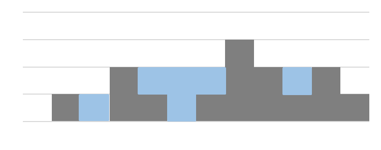

Practice5
===

문제 설명
---
<<<<<<< HEAD

N 명의 아이들이 한 줄로 서있다.  
각각의 아이들은 점수 표를 가지고 있는데 점수 표에 따라 다음과 같은 규칙으로 사탕을 나누어 줘야 한다.

* 적어도 1개 이상의 사탕을 나누어줘야 한다.
* 점수가 높은 아이에게는 바로 옆의 아이 보다는 사탕을 많이 줘야 한다.

N 명의 아이들에 대한 점수 표가 ratings 배열에 주어질 때,  
나누어 줘야하는 최소한의 사탕 개수를 출력하세요.

입출력 예시
---

|입력|출력|
|---|---|
|1 2 3|6|
|3 2 1|6|
|1 0 2|5|
|1 2 2|4|
|1, 3, 5, 3, 1, 3, 5, 7, 5, 3, 1, 0|29|

=======
n개의 정수형 데이터가 height 배열에 주어졌다.  
height 배열의 각각의 원소는 아래 그림과 같이 각 벽에 대한 높이를 의미한다.

이와 같이 높이 값들이 주어졌을 때,  
벽 사이사이의 빈 공간에 담을 수 있는 물의 총량을 출력하세요.

입출력 예시
---
|입력|출력|
|---|---|
|0, 1, 0, 2, 1, 0, 1, 3, 2, 1, 2, 1|6|
|4, 2, 0, 3, 2, 5|9|
>>>>>>> 14c122c (자바 연습문제 3)
